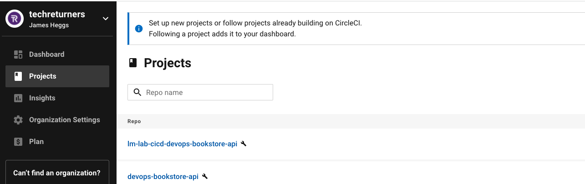
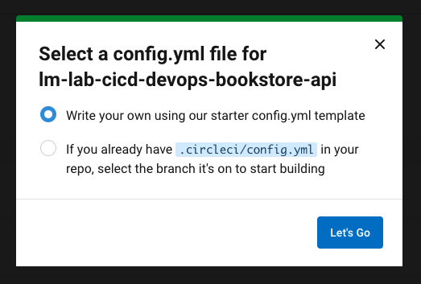
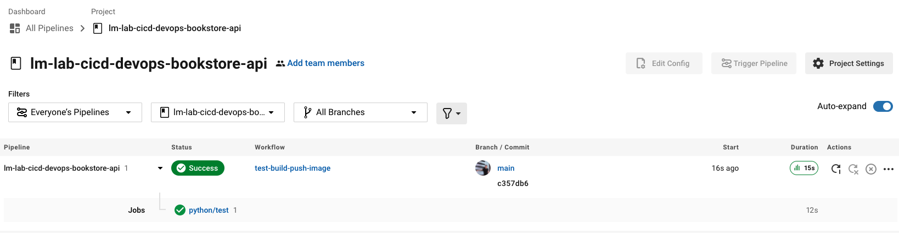

# Setting up your CI/CD pipeline

In the next series of steps we'll make use of CircleCI to create a build, test and publish pipeline.

The pipeline will build your Python application, run the unit tests and if all passes then it will automatically publish a docker image to your container registry.

**NOTE:** You do NOT have to pay for any features of CircleCI in order to complete this tutorial.

### Step 1 - Create the pipeline as code files

As you might have guessed, we'd like to setup the build pipeline in code. CircleCI uses a concept of [pipelines as code](https://circleci.com/docs/2.0/pipelines/) to configure the various build steps.

By default the tool will look for a file called `config.yml` located within a `.circleci` directory.

Let's go ahead and create that file ready for enabling CircleCI.

Create a new directory in the root of the project called `.circleci`

```
mkdir .circleci
```

Then create a new file within that directory called `config.yml` and place the following contents in that file:

```yaml
version: 2.1

orbs:
  python: circleci/python@1.5.0

workflows:
  test-build-push-image:
    jobs:
      - python/test:
          args: '--dev'
          pkg-manager: pipenv
          test-tool: unittest 
```

Let's understand that file. The `version` part identifies which version of CircleCI pipelines we are using.

Then comes the `orbs`. A [CircleCI orb](https://circleci.com/docs/2.0/orb-intro/) are re-usable bits of config for your pipeline that come ready with the required software. So in our case we utilise a pre-existing Python orb that has all the required Python software availavble to build and run our tests.

You can see the material for this specific [Python orb on the CircleCI site](https://circleci.com/developer/orbs/orb/circleci/python).

After that we define the `workflow`.

Firstly we give the workflow a name, in our case `test-build-push-image`. Then within that section we define the jobs we want that workflow to perform. These are essentially the build steps. The [python/test](https://circleci.com/developer/orbs/orb/circleci/python#usage-using-test-job) job is pre-created for us and ready to use because we are using the Python orb. This will install our dependencies and run the unit tests.

Ok so thats a whistle stop tour of CircleCI config. Now it's time to set-up your CircleCI account. 

When you're finished, don't forget to **Commit and Push** your changes back to GitHub.

### Step 2 - Create CircleCI account

Head over to CircleCI and [Signup for a new account](https://circleci.com/signup/). 

Sign up using your GitHub account and this will mean you'll automatically be able to add your GitHub repositories as CircleCI projects. 

Once you've signed up head to step 3 to configure your project.

### Step 3 - Configure Circle project

Navigate to the **Projects** section of CircleCI. You should see a screen that looks similar to the image below:



You should see your **devops-bookstore-api** GitHub project listed. (CircleCI will automatically read your public repositories)

Click the **Set Up Project** button

It should pop up a dialog where it scans for CircleCI config and look similar to this image:



You've already configured your pipeline so choose the **If you already have...** option.

It will then ask you for the branch that the `config.yml` is located on. This will be either **master** or **main** depending on the nature of how you have set up your repository. You'll know you have entered the right branch when you see a green tick and the message:

```
.circleci/config.yml found on this branch
```

Click **Let's Go**

All things being well it should run your pipeline and you should see a success message:



Pat yourself on your back and grab a drink!! ☕️

You've configured the build and test (essentially the CI - Continuous Integration) phase of the pipeline.

Head back to the [README to finish off with step 3](../README.md) and let's get that CD - Continuous Delivery phase done.
